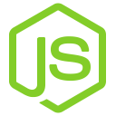

  <h1>Hi, I'm Vaibhav Kolekar 👋</h1>
  
<strong>Full-Stack & Systems Developer</strong> based in Bengaluru, India 🇮🇳

  

    
    &nbsp;&nbsp;&nbsp;&nbsp;
    
    &nbsp;&nbsp;&nbsp;&nbsp;
    
    &nbsp;&nbsp;&nbsp;&nbsp;
    
  

  

    <code>🟢 Open to Full-Stack, Backend & TypeScript Roles · Available Now</code>
  

  ---

## ⚡ About Me

I design and build production-grade, event-driven full-stack systems in **TypeScript** — handling everything from low-latency WebSocket bridges and distributed background queues to database schemas, containerization, and cloud infrastructure.

- 🛠️ **Core Expertise**: Full-Stack TypeScript (PERN Stack: PostgreSQL, Express, React, Node.js), Redis, WebSockets, Docker, AWS, & Distributed Systems.
- ⚡ **Real-Time & AI Systems**: Built **Interviu**, an AI-powered voice-to-voice mock interview engine using Google's Gemini Flash Live API & Claude Sonnet.
- 📊 **Distributed Systems & Observability**: Engineered **Pingdeck**, a microservices uptime & metrics platform (Prometheus, Grafana Loki, BullMQ), and a **Distributed Job Scheduler** using PostgreSQL `FOR UPDATE SKIP LOCKED`.

---

## 🚀 Featured Engineering Projects

### 01. [Interviu — AI Mock Interview Platform](https://interviu.pro)
> **Live Web App**: [interviu.pro](https://interviu.pro) &nbsp;|&nbsp; **Repository**: [`va18hav/interviuPro`](https://github.com/va18hav/interviuPro)

An end-to-end, voice-first mock interview platform that simulates realistic technical, system design, and behavioral interviews with bidirectional audio streaming and live code synchronization.

  &nbsp;
  &nbsp;
  &nbsp;
  &nbsp;
  &nbsp;
  &nbsp;
  &nbsp;
  &nbsp;
  &nbsp;
  

- **Real-Time Voice Bridge (400–500ms TTFT)**: Implemented a raw WebSocket proxy server piping 16kHz PCM audio buffers between the client and Google GenAI Live API for fluid conversational pacing.
- **Monaco Code Editor Sync**: Built a debounced `[EDITOR_UPDATE]` context synchronization pipeline that injects live candidate code edits into the model's window without disturbing audio streaming.
- **Resilient Session Persistence**: Engineered a Redis session cache layer with a 30-second connection recovery window to preserve active interview state during network dropouts.
- **Dual-Model Feedback Pipeline**: Decoupled voice interaction from evaluation; flushes full transcripts to Anthropic's Claude 3.5 Sonnet to generate structured JSON scorecards and actionable feedback.

---

### 02. [Pingdeck — API Testing & Uptime Monitoring Platform](https://app.pingdeck.xyz)
> **Live Web App**: [app.pingdeck.xyz](https://app.pingdeck.xyz) &nbsp;|&nbsp; **Repository**: [`va18hav/pingdeck`](https://github.com/va18hav/pingdeck)

A decoupled, microservices-based API monitoring and telemetry platform featuring distributed alerting queues, container log aggregation, and Prometheus metrics exporting.

  &nbsp;
  &nbsp;
  &nbsp;
  &nbsp;
  &nbsp;
  &nbsp;
  &nbsp;
  &nbsp;
  &nbsp;
  &nbsp;
  &nbsp;
  &nbsp;
  

- **Decoupled Worker Engine**: Separated health-check pings from the HTTP runtime using BullMQ and Redis queues; verified **64 req/sec** API gateway throughput with **sub-110ms p95 latency** via k6 and **125 jobs/sec** DB write performance.
- **Multi-Stage Alert Dispatching**: Created isolated event queues for failure notifications (via Resend API) so downstream alerting retries never stall primary health monitor workers.
- **Container Observability Pipeline**: Configured Promtail daemons scraping `/var/run/docker.sock` to parse structured Pino JSON logs into indexable Grafana Loki streams without application overhead.
- **Prometheus Telemetry Instrumentation**: Embedded custom `prom-client` counters and execution duration histograms exposed on dedicated metrics ports.

---

### 03. [Distributed Job Scheduler](https://github.com/va18hav/distributed-job-scheduler)
> **Repository**: [`va18hav/distributed-job-scheduler`](https://github.com/va18hav/distributed-job-scheduler)

A lightweight, database-backed background task processing engine built from scratch with ACID transactional guarantees, non-blocking polling, and lease-based worker crash recovery.

  &nbsp;
  &nbsp;
  &nbsp;
  &nbsp;
  &nbsp;
  &nbsp;
  

- **Non-Blocking Dequeue (`FOR UPDATE SKIP LOCKED`)**: Leverages PostgreSQL row-level locking to allow multiple worker processes to concurrently claim tasks without lock contention or double-allocation.
- **Lease-Based Crash Recovery**: Implemented heartbeat timestamp pings (`lockedAt`); automatically reclaims and reschedules stalled jobs if a worker node crashes or freezes for over 30 seconds.
- **Graceful OS Interrupt Traps**: Trapped `SIGINT`/`SIGTERM` process signals to halt polling loops, drain in-flight jobs, clear heartbeat timers, and release database client connections cleanly.
- **Strategy Pattern Registry & Telemetry**: Built a type-safe handler execution registry alongside lock-free `/job/stats` real-time queue depth telemetry.

---

## 🛠️ Technical Stack & Tools

<table align="center">
  <tr>
    <td align="center" width="125">
      
       
      <b>TYPESCRIPT</b>
    </td>
    <td align="center" width="125">
      
       
      <b>REACT</b>
    </td>
    <td align="center" width="125">
      
       
      <b>ZUSTAND</b>
    </td>
    <td align="center" width="125">
      
       
      <b>TANSTACK QUERY</b>
    </td>
    <td align="center" width="125">
      
       
      <b>TAILWIND CSS</b>
    </td>
    <td align="center" width="125">
      
       
      <b>NODE.JS</b>
    </td>
  </tr>
  <tr>
    <td align="center" width="125">
      
       
      <b>EXPRESS</b>
    </td>
    <td align="center" width="125">
      
       
      <b>WEBSOCKETS</b>
    </td>
    <td align="center" width="125">
      
       
      <b>BULLMQ</b>
    </td>
    <td align="center" width="125">
      
       
      <b>POSTGRESQL</b>
    </td>
    <td align="center" width="125">
      
       
      <b>REDIS</b>
    </td>
    <td align="center" width="125">
      
       
      <b>PRISMA</b>
    </td>
  </tr>
  <tr>
    <td align="center" width="125">
      
       
      <b>DOCKER</b>
    </td>
    <td align="center" width="125">
      
       
      <b>AWS</b>
    </td>
    <td align="center" width="125">
      
       
      <b>NGINX</b>
    </td>
    <td align="center" width="125">
      
       
      <b>VERCEL</b>
    </td>
    <td align="center" width="125">
      
       
      <b>GIT</b>
    </td>
    <td align="center" width="125">
      
       
      <b>JEST</b>
    </td>
  </tr>
  <tr>
    <td align="center" width="125">
      
       
      <b>POSTMAN</b>
    </td>
    <td align="center" width="125">
      
       
      <b>PROMETHEUS</b>
    </td>
    <td align="center" width="125">
      
       
      <b>GRAFANA LOKI</b>
    </td>
    <td align="center" width="125">
      
       
      <b>K6</b>
    </td>
    <td align="center" width="125"></td>
    <td align="center" width="125"></td>
  </tr>
</table>
